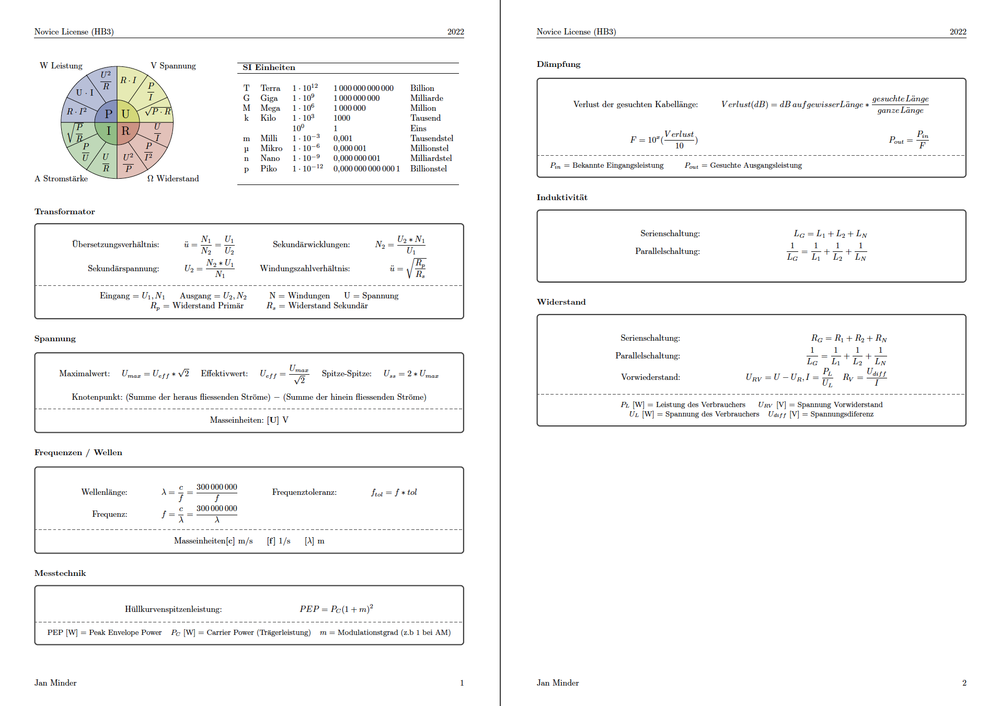

# Formula Collection (CEPT NOVICE)

A simple formula collection based on the public available [questionnaire](https://www.bakom.admin.ch/bakom/de/home/frequenzen-antennen/funkerpruefungen/amateurfunk-pruefungen.html) from Federal Office of Communications (switzerland).



## Development

## Build

The project requires a TeX environment including [latexmk](https://ctan.org/pkg/latexmk). 

```
latexmk -diagnostics --file-line-error --interaction=nonstopmode -pdf -jobname=cept_novice_formula_collection collection.tex
```

## Edit TikZ Images

I've used [TikZiT](https://tikzit.github.io/) for drawing TikZ Images.